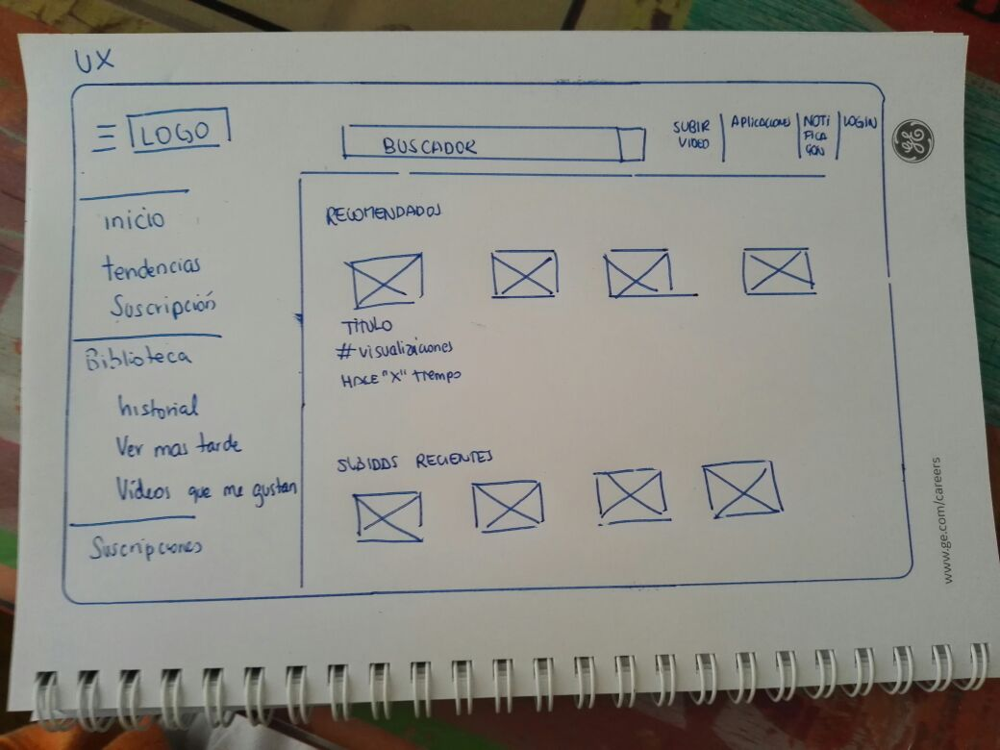

# 1. Elige una web de tu preferencia y explica qué partes conforman el UX y qué partes el UI

### Objetivo

Identificar las partes que conforman UX VS UI

## Youtube

#### **UX**

Se ha realizado un sketch para una mejor visualización del trabajo del UX.

Gracias a su investigación, el propone como la gente puede resolver sus problemas, entender sus necesidades, como hacer la página más eficiente.

#### **UI**

Todo lo que respecta a la navegación, iconografía, color, menús, desplegables, botones, links, ventanas, esquinas redondeadas, sombreado, mensajes de error, alertas, actualizaciones, checkboxes, campos de contraseña, etc. Estan representados por el UI.

### **Alumna**

>##### Stephanie Wong Vega

